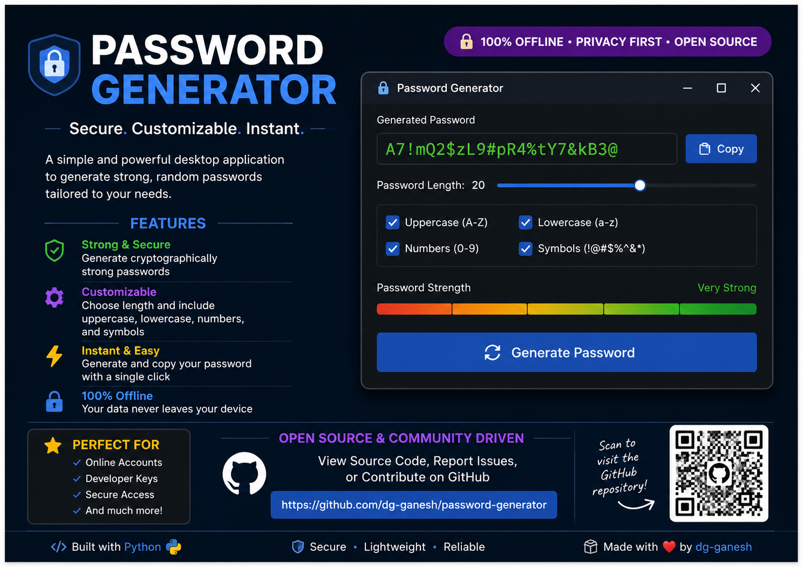
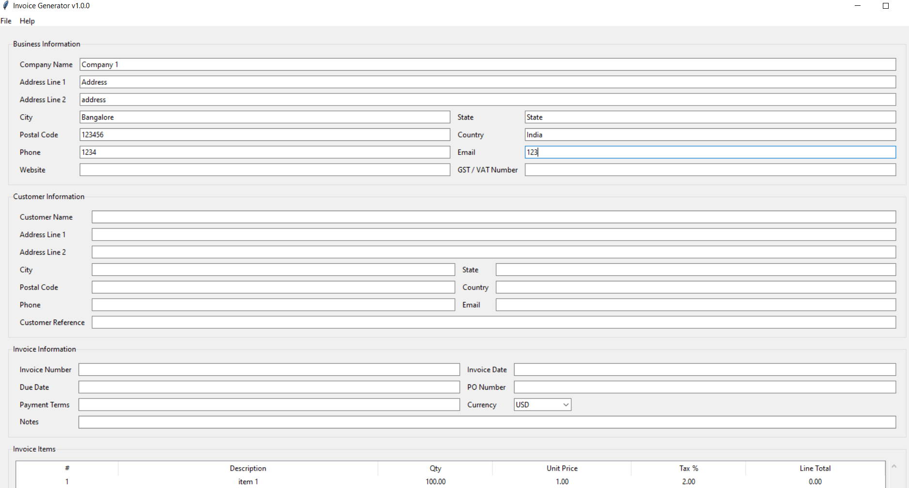
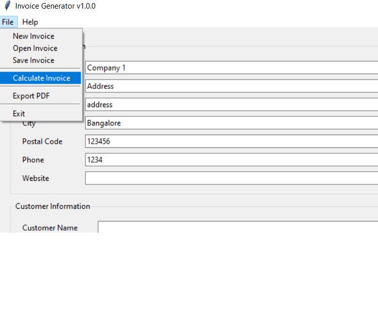
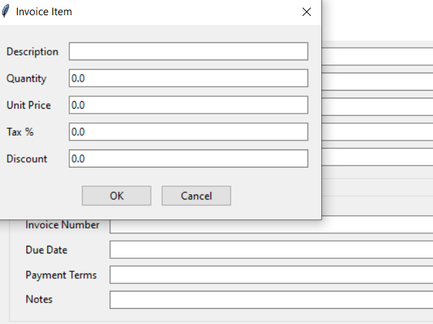
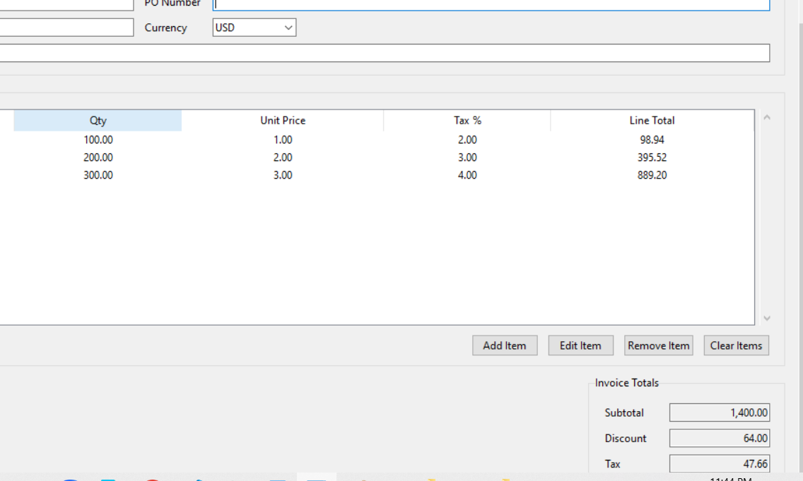
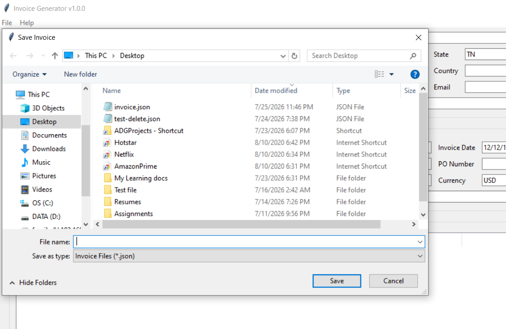
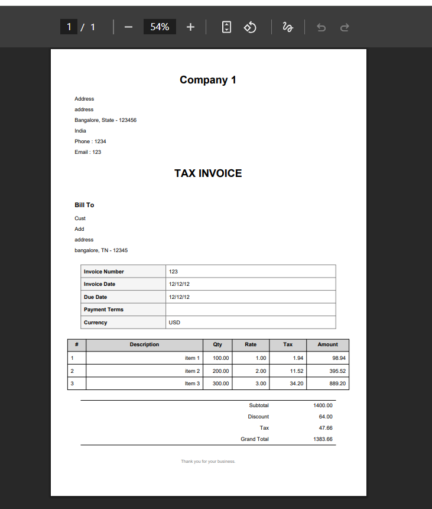

# Project Badges


---

# Screenshots

## Main Window



---

## Menu Options



---

## Adding Invoice Items



---

## Invoice Calculation



---

## Save Invoice



---

## Generated PDF



---

# Invoice Generator

A desktop application for creating, calculating, saving, loading, and exporting professional invoices.

---

# Project Overview

## Purpose

Invoice Generator is a desktop-based invoicing application developed using Python and Tkinter. It enables businesses and individuals to create professional invoices, automatically calculate taxes and totals, save invoices for future editing, and export them as PDF documents.

The application follows a modular architecture with clear separation between the user interface, business logic, data models, validation, serialization, and document generation services.

---

## Problem Solved

Manual invoice preparation often involves repetitive calculations, formatting inconsistencies, and maintaining separate copies of customer information. This application automates the invoicing workflow while ensuring calculation accuracy and providing reusable invoice records.

---

## Typical Use Cases

- Small business invoicing
- Freelance billing
- Service-based businesses
- Consulting engagements
- Internal quotation generation
- Customer invoice management
- PDF invoice generation
- Invoice archival using JSON
- Desktop-based offline invoicing

---
# Features

The Invoice Generator provides a complete desktop invoicing workflow with professional PDF export and persistent invoice management.

### Invoice Management

- Create new invoices
- Edit existing invoices
- Save invoices as JSON
- Load previously saved invoices
- Export invoices as PDF
- Clear current invoice

---

### Company Information

- Company Name
- Address Line 1
- Address Line 2
- City
- State
- Postal Code
- Country
- Phone Number
- Email Address
- Website
- Tax Registration Number

---

### Customer Information

- Customer Name
- Address Line 1
- Address Line 2
- City
- State
- Postal Code
- Country
- Phone Number
- Email Address
- Customer Reference

---

### Invoice Information

- Invoice Number
- Invoice Date
- Due Date
- Purchase Order Number
- Payment Terms
- Currency
- Notes

---

### Invoice Items

- Add Items
- Edit Items
- Remove Items
- Clear All Items
- Automatic Line Numbering
- Automatic Line Total Calculation

Each invoice item supports:

- Description
- Quantity
- Unit Price
- Tax Percentage
- Discount Percentage
- Tax Amount
- Discount Amount
- Line Total

---

### Automatic Calculations

The application automatically calculates:

- Line Subtotal
- Discount Amount
- Tax Amount
- Invoice Subtotal
- Total Discount
- Total Tax
- Grand Total

---

### PDF Generation

- Professional invoice layout
- Company information
- Customer information
- Invoice details
- Itemized invoice table
- Totals section
- Notes
- Printable PDF output

---

### User Experience

- Desktop application
- Responsive layout
- Scrollable invoice items
- Menu driven operations
- Input validation
- Error handling
- Success notifications

---

# Technology Stack

| Category | Technology |
|-----------|------------|
| Language | Python 3.14 |
| GUI Framework | Tkinter (ttk) |
| PDF Generation | ReportLab |
| Data Storage | JSON |
| Data Models | Python Dataclasses |
| Build Tool | PyInstaller |
| Version Control | Git |
| Repository Hosting | GitHub |
| IDE | Visual Studio Code |
| Operating System | Windows 10 |

---

# Project Structure

```text
Invoice Generator
│
├── assets/
│   ├── fonts/
│   ├── icons/
│   ├── images/
│   └── templates/
│
├── data/
│   ├── input/
│   ├── output/
│   └── samples/
│
├── docs/
│   └── UserGuide.md
│
├── logs/
│
├── releases/
│   ├── latest/
│   ├── v1.0/
│   └── v1.1/
│
├── screenshots/
│
├── src/
│   ├── core/
│   ├── models/
│   ├── services/
│   ├── ui/
│   ├── utils/
│   └── config.py
│
├── tests/
│
├── main.py
├── README.md
├── LICENSE
├── requirements.txt
└── pyproject.toml
```

---

## Repository Organization

| Folder | Purpose |
|---------|----------|
| assets | Images, icons, templates and other static resources |
| data | Input, output and sample invoice files |
| docs | Project documentation and user guide |
| logs | Execution reports and application logs |
| releases | Executable builds grouped by version |
| screenshots | Application screenshots used in documentation |
| src | Complete application source code |
| tests | Test cases and future automated tests |

---
# Module Overview

The Invoice Generator follows a layered architecture that separates presentation, business logic, data models, and infrastructure services. This separation improves maintainability, testability, and future extensibility.

| Module | Responsibility |
|----------|----------------|
| **UI** | Implements the graphical user interface including windows, panels, dialogs, and user interactions. |
| **Core** | Contains the business logic for invoice creation, validation, and financial calculations. |
| **Models** | Defines the application's data structures using dataclasses. |
| **Services** | Provides persistence, PDF generation, serialization, deserialization, and logging services. |
| **Configuration** | Stores application-wide configuration values. |
| **Assets** | Static resources including images, icons, templates, and fonts. |
| **Data** | Stores input, output, and sample invoice files. |
| **Documentation** | Project documentation and user guides. |
| **Screenshots** | Images used for GitHub documentation and portfolio presentation. |
| **Releases** | Packaged application builds organized by version. |
| **Tests** | Reserved for automated and manual testing. |

---

# Application Architecture

The application follows a modular layered architecture where the user interface coordinates business operations while keeping calculations, validation, persistence, and document generation independent.

```text
                               +----------------------+
                               |      main.py         |
                               +----------+-----------+
                                          |
                                          ▼
                               +----------------------+
                               |    Main Window       |
                               +----------+-----------+
                                          |
                                          ▼
                               +----------------------+
                               |    Invoice Form      |
                               |    (Coordinator)     |
                               +----------+-----------+
                                          |
              +---------------------------+---------------------------+
              |                           |                           |
              ▼                           ▼                           ▼
      Company Panel               Customer Panel              Invoice Panel
              |                           |                           |
              +---------------------------+---------------------------+
                                          |
                                          ▼
                              Invoice Items Panel
                                          |
                                          ▼
                              Invoice Item Dialog
                                          |
                                          ▼
                                 Invoice Builder
                                          |
                                          ▼
                               Invoice Validator
                                          |
                                          ▼
                              Invoice Calculator
                                          |
                                          ▼
                                 Totals Panel
                                          |
           +------------------------------+------------------------------+
           |                              |                              |
           ▼                              ▼                              ▼
   JSON Serializer              PDF Export Service          JSON Deserializer
           |                              |                              |
           ▼                              ▼                              ▼
      JSON File                    PDF Document                  JSON File
```

---

# Layer Responsibilities

## Presentation Layer

Responsible for collecting user input, displaying invoice information, and coordinating application workflows.

Components include:

- Main Window
- Invoice Form
- Company Panel
- Customer Panel
- Invoice Panel
- Invoice Items Panel
- Totals Panel
- Action Panel
- Invoice Item Dialog

---

## Business Layer

Responsible for implementing the application's business rules.

Components include:

- Invoice Builder
- Invoice Validator
- Invoice Calculator

These modules perform all invoice construction, validation, and financial calculations while remaining independent of the user interface.

---

## Data Layer

Represents the application's business entities.

Models include:

- CompanyModel
- CustomerModel
- InvoiceModel
- InvoiceItemModel

These models are shared throughout the application and provide a consistent data contract between layers.

---

## Service Layer

Responsible for interactions with external resources.

Services include:

- Invoice Serializer
- Invoice Deserializer
- JSON File Service
- PDF Export Service
- PDF Styles
- Execution Logging Service

These modules isolate persistence and document generation from the business logic.

---

# Data Flow

The overall application workflow follows the sequence below.

```text
User Input
      │
      ▼
Invoice Form
      │
      ▼
Invoice Builder
      │
      ▼
Invoice Validator
      │
      ▼
Invoice Calculator
      │
      ▼
Updated Invoice Model
      │
      ├──────────────► Save JSON
      │
      ├──────────────► Load JSON
      │
      └──────────────► Export PDF
```

---

# Design Principles

The application was designed around the following engineering principles.

- Separation of Concerns
- Layered Architecture
- Modular Design
- Single Responsibility Principle
- Reusable Components
- Centralized Business Logic
- Dataclass-based Domain Models
- Service-Oriented Document Processing
- UI Independent Business Rules
- Extensible Project Structure

---
# Source Code Overview

The following table provides a high-level overview of every Python source file in the project. Each module is documented with its primary responsibility and major dependencies to provide a complete understanding of the application's architecture.

---

## Application Entry Point

| Source File | Purpose | Dependencies |
|-------------|---------|--------------|
| **main.py** | Application entry point. Initializes the application, creates the main window, and starts the Tkinter event loop. | Tkinter, Main Window |
| **src/config.py** | Stores application-wide configuration values and shared settings used across the project. | Python Configuration |

---

## Core Modules

### Invoice Calculation

| Source File | Purpose | Dependencies |
|-------------|---------|--------------|
| **src/core/calculation/invoice_calculator.py** | Performs all invoice financial calculations including subtotals, taxes, discounts, and grand totals. Updates calculated values within the invoice model. | InvoiceModel, InvoiceItemModel |

---

### Invoice Builder

| Source File | Purpose | Dependencies |
|-------------|---------|--------------|
| **src/core/invoice/invoice_builder.py** | Creates complete invoice objects from user input while assembling company, customer, invoice information, and invoice items into a single business object. | InvoiceModel, CompanyModel, CustomerModel |

---

### Invoice Validation

| Source File | Purpose | Dependencies |
|-------------|---------|--------------|
| **src/core/validation/invoice_validator.py** | Validates invoice data before calculations, saving, PDF generation, or export. Ensures required fields and business rules are satisfied. | InvoiceModel |

---

## Data Models

### Company Model

| Source File | Purpose | Dependencies |
|-------------|---------|--------------|
| **src/models/company_model.py** | Defines the company information data structure including address, contact information, website, and tax registration details. | Python Dataclasses |

---

### Customer Model

| Source File | Purpose | Dependencies |
|-------------|---------|--------------|
| **src/models/customer_model.py** | Represents customer information including contact details, billing address, and customer reference information. | Python Dataclasses |

---

### Invoice Item Model

| Source File | Purpose | Dependencies |
|-------------|---------|--------------|
| **src/models/invoice_item_model.py** | Represents an individual invoice line item including pricing, quantities, taxes, discounts, and calculated totals. | Python Dataclasses |

---
## Invoice Model

| Source File | Purpose | Dependencies |
|-------------|---------|--------------|
| **src/models/invoice_model.py** | Represents the complete invoice business object. Aggregates company information, customer information, invoice details, invoice items, calculated totals, and document metadata into a single model. | CompanyModel, CustomerModel, InvoiceItemModel, Python Dataclasses |

---

# Document Services

The Document Services layer provides serialization, deserialization, and document generation capabilities. These modules isolate external document formats from the application's business logic.

---

## Invoice Serializer

| Source File | Purpose | Dependencies |
|-------------|---------|--------------|
| **src/services/document/invoice_serializer.py** | Converts an InvoiceModel into a JSON-compatible dictionary for persistence. Serializes all nested business objects while preserving the complete invoice structure. | InvoiceModel |

---

## Invoice Deserializer

| Source File | Purpose | Dependencies |
|-------------|---------|--------------|
| **src/services/document/invoice_deserializer.py** | Reconstructs an InvoiceModel from previously saved JSON data. Restores company, customer, invoice details, invoice items, and calculated values. | InvoiceModel, CompanyModel, CustomerModel, InvoiceItemModel |

---

## PDF Export Service

| Source File | Purpose | Dependencies |
|-------------|---------|--------------|
| **src/services/document/pdf_export_service.py** | Generates professional PDF invoices from the InvoiceModel. Produces printable invoices containing company information, customer information, invoice details, itemized tables, totals, notes, and footer sections. | ReportLab, PdfStyles, InvoiceModel |

---

## PDF Styles

| Source File | Purpose | Dependencies |
|-------------|---------|--------------|
| **src/services/document/pdf_styles.py** | Centralizes all ReportLab paragraph styles, table styles, page margins, fonts, spacing, and formatting used during PDF generation to ensure a consistent invoice appearance. | ReportLab |

---

# File Services

## JSON File Service

| Source File | Purpose | Dependencies |
|-------------|---------|--------------|
| **src/services/file/json_file_service.py** | Provides reusable JSON file read and write operations. Encapsulates file handling and JSON persistence for invoice storage. | JSON |

---

# Logging Services

## Execution Logging Service

| Source File | Purpose | Dependencies |
|-------------|---------|--------------|
| **src/services/logging/execution_logging_service.py** | Records execution details, application events, and runtime information to support troubleshooting, diagnostics, and future auditing capabilities. | Python Logging |

---
# User Interface Layer

The User Interface layer provides the graphical interface for interacting with the Invoice Generator. It coordinates user input, delegates business operations to the Core layer, and displays calculated results.

---

## Main Window

| Source File | Purpose | Dependencies |
|-------------|---------|--------------|
| **src/ui/main_window.py** | Creates the main application window, configures the desktop layout, application menu, scrolling behavior, and hosts the Invoice Form coordinator. | Tkinter, InvoiceForm |

---

## Invoice Form

| Source File | Purpose | Dependencies |
|-------------|---------|--------------|
| **src/ui/invoice_form.py** | Acts as the central coordinator of the application. It connects all user interface panels with the business logic, validation, persistence, calculations, and PDF generation services. | Tkinter, InvoiceBuilder, InvoiceCalculator, InvoiceValidator, Serializer, Deserializer, PDF Export Service |

---

## Dialogs

### Invoice Item Dialog

| Source File | Purpose | Dependencies |
|-------------|---------|--------------|
| **src/ui/dialogs/invoice_item_dialog.py** | Provides the dialog used to create and edit invoice line items. Performs input validation before returning an InvoiceItemModel to the Invoice Items Panel. | Tkinter, InvoiceItemModel |

---

# User Interface Panels

The user interface is divided into reusable panels. Each panel is responsible for a single area of the application, improving maintainability and separation of concerns.

---

## Action Panel

| Source File | Purpose | Dependencies |
|-------------|---------|--------------|
| **src/ui/panels/action_panel.py** | Displays the application's primary action buttons including New Invoice, Calculate, Save, Load, Export PDF, and Clear. Exposes callback registration methods for the Invoice Form coordinator. | Tkinter |

---

## Company Panel

| Source File | Purpose | Dependencies |
|-------------|---------|--------------|
| **src/ui/panels/company_panel.py** | Collects and displays company information including business name, address, contact details, website, and tax registration information. | Tkinter, CompanyModel |

---

## Customer Panel

| Source File | Purpose | Dependencies |
|-------------|---------|--------------|
| **src/ui/panels/customer_panel.py** | Collects customer billing information including address, contact details, and customer reference information. | Tkinter, CustomerModel |

---

## Invoice Panel

| Source File | Purpose | Dependencies |
|-------------|---------|--------------|
| **src/ui/panels/invoice_panel.py** | Collects invoice-specific information including invoice number, dates, purchase order number, payment terms, currency, and notes. | Tkinter, InvoiceModel |

---

## Invoice Items Panel

| Source File | Purpose | Dependencies |
|-------------|---------|--------------|
| **src/ui/panels/invoice_items_panel.py** | Displays invoice line items using a TreeView. Supports adding, editing, removing, clearing, and managing invoice items while coordinating with the Invoice Item Dialog. | Tkinter, InvoiceItemDialog, InvoiceItemModel |

---

## Totals Panel

| Source File | Purpose | Dependencies |
|-------------|---------|--------------|
| **src/ui/panels/totals_panel.py** | Displays calculated invoice totals including subtotal, discount, tax, and grand total after invoice calculations have been completed. | Tkinter, InvoiceModel |

---

# Source Code Summary

The project contains the following primary source modules.

| Layer | Number of Source Files |
|---------|----------------------:|
| Application Entry | 2 |
| Core Business Logic | 3 |
| Data Models | 4 |
| Document Services | 4 |
| File Services | 1 |
| Logging Services | 1 |
| User Interface | 9 |
| **Total Python Source Files** | **24** |

The modular architecture separates presentation, business logic, data models, persistence, and document generation into independent layers. This organization improves readability, maintainability, testing, and future extensibility while keeping business rules independent from the graphical user interface.

---
# How to Run

## Prerequisites

Ensure the following software is installed before running the application.

| Software | Version |
|-----------|---------|
| Python | 3.14 or later |
| Git | Latest |
| Visual Studio Code | Recommended |

---

## Clone the Repository

```bash
git clone https://github.com/dg-ganesh/invoice-generator.git

cd invoice-generator
```

---

## Install Dependencies

```bash
pip install -r requirements.txt
```

---

## Launch the Application

```bash
python main.py
```

The application will launch the desktop interface where invoices can be created, edited, calculated, saved, loaded, and exported as PDF documents.

---

# How to Build

The project can be packaged as a standalone Windows executable using PyInstaller.

## Build Command

```bash
pyinstaller ^
--noconfirm ^
--onefile ^
--windowed ^
--name "Invoice Generator" ^
main.py
```

---

## Build Output

After a successful build, the executable will be generated in:

```text
dist/
    Invoice Generator.exe
```

---

## Distribution

The executable can be distributed without requiring users to install Python.

Supporting files such as sample invoices, documentation, and screenshots may be included separately depending on the deployment package.

---

# Version

| Property | Value |
|----------|-------|
| Project | Invoice Generator |
| Project ID | 013 |
| Current Version | 1.0.0 |
| Release Date | July 2026 |
| Status | Stable |
| Application Type | Desktop Application |
| Platform | Windows |
| Language | Python |

---

# Development Workflow

The project followed a structured engineering workflow to ensure modularity, maintainability, and consistent implementation.

```text
Requirements
      │
      ▼
Project Planning
      │
      ▼
Architecture Design
      │
      ▼
Data Model Design
      │
      ▼
UI Design
      │
      ▼
Business Logic Implementation
      │
      ▼
Validation
      │
      ▼
Invoice Calculation
      │
      ▼
Persistence (JSON)
      │
      ▼
PDF Generation
      │
      ▼
Integration Testing
      │
      ▼
Executable Build
      │
      ▼
GitHub Repository
      │
      ▼
Portfolio Release
```

---

## Development Principles

The project was implemented using the following engineering principles.

- Modular Architecture
- Separation of Concerns
- Layered Design
- Object-Oriented Programming
- Reusable Components
- Single Responsibility Principle
- Service-Oriented Design
- Consistent Coding Standards
- Maintainable Folder Structure
- Professional Documentation

---

## Quality Assurance

The completed application has been verified for the following functional areas.

| Component | Status |
|-----------|--------|
| Company Information | ✅ |
| Customer Information | ✅ |
| Invoice Information | ✅ |
| Invoice Item Management | ✅ |
| Automatic Calculations | ✅ |
| Totals Display | ✅ |
| Save Invoice | ✅ |
| Load Invoice | ✅ |
| Export PDF | ✅ |
| Menu Operations | ✅ |
| User Interface | ✅ |
| Error Handling | ✅ |

---
# License

This project is licensed under the **MIT License**.

See the [LICENSE](LICENSE) file for complete license information.

---

# Repository Highlights

This repository demonstrates a complete desktop application developed using a layered architecture and modern Python engineering practices.

## Key Highlights

- Modular application architecture
- Separation of UI, business logic, models, and services
- Professional desktop user interface
- Automatic invoice calculations
- JSON-based persistence
- Professional PDF invoice generation
- Reusable data models
- Layered validation and calculation engine
- Comprehensive engineering documentation
- GitHub portfolio ready

---

# Future Enhancements

The current implementation provides a stable desktop invoicing solution. Future versions may include the following enhancements.

### User Experience

- Company logo support
- Multiple invoice themes
- Dark mode
- Keyboard shortcuts
- User preferences

---

### Business Features

- Automatic invoice numbering
- Product and service catalog
- Customer database
- Tax profile management
- Multi-currency formatting

---

### Reporting

- Invoice history
- Revenue summaries
- Customer-wise reporting
- Export to Microsoft Excel

---

### Deployment

- Windows Installer
- Automatic update mechanism
- Digital code signing
- Portable application package

---

# Project Statistics

| Metric | Value |
|---------|------:|
| Project ID | 013 |
| Project Name | Invoice Generator |
| Application Type | Desktop Application |
| Programming Language | Python |
| GUI Framework | Tkinter |
| PDF Library | ReportLab |
| Data Format | JSON |
| Architecture | Layered Modular Architecture |
| Source Files | 24 |
| Documentation | Complete |
| Portfolio Status | Production Ready |

---

# Author

**Ganesh DG**

GitHub Portfolio Project

---

# Acknowledgements

This project was developed as part of a structured Python desktop application portfolio with emphasis on:

- Software Engineering
- Clean Architecture
- Modular Design
- Object-Oriented Programming
- Desktop Application Development
- Professional Documentation
- GitHub Portfolio Readiness

---

# Support

If you discover a defect or have suggestions for improvement, please create an issue in the GitHub repository.

---

# Repository Status

> **Status:** ✅ Completed

This project has reached **Version 1.0** and all core functionality has been implemented and verified, including:

- Company Management
- Customer Management
- Invoice Management
- Invoice Item Management
- Automatic Calculations
- Save & Load
- PDF Export
- Professional Desktop User Interface

The repository is suitable for portfolio presentation, technical interviews, recruiter evaluation, and freelance client demonstrations.

---
